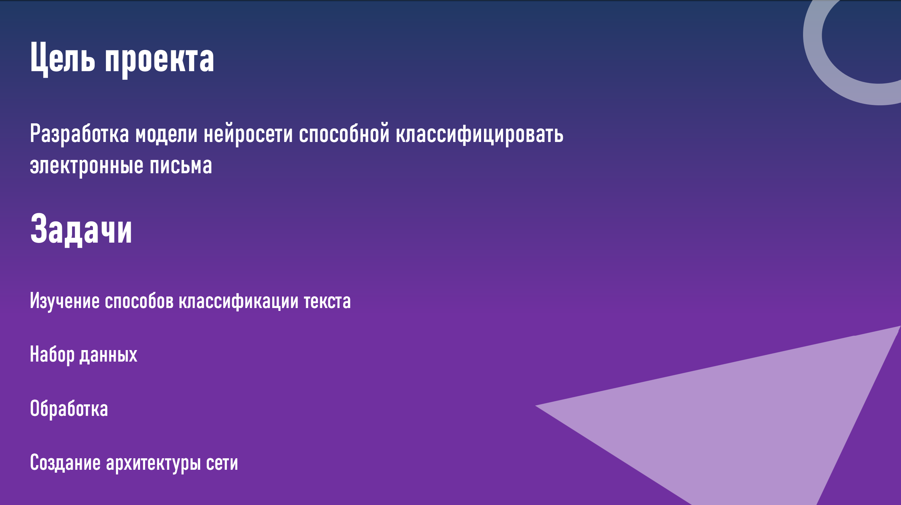
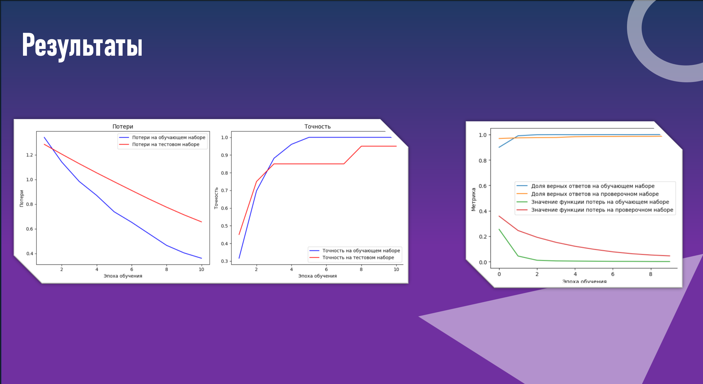

# 📧 Классификация электронных писем

Проект по автоматической классификации электронных писем (спам vs. не-спам) с помощью нейронных сетей.

  
  

---

## 📌 Описание проекта

В этом проекте мы:

1. Собираем и подготавливаем корпус писем (Enron, собственные данные).  
2. Выполняем предобработку текста: токенизация, удаление стоп‑слов, лемматизация.  
3. Строим и обучаем модели на основе:
   - Рекуррентных нейронных сетей (LSTM/GRU)  
   - Трансформеров (BERT)  
4. Оцениваем модели метриками Precision, Recall, F1‑score и ROC AUC.  
5. Сравниваем результаты и сохраняем лучшую модель.

---

## 🛠️ Технологии

- Python 3.8+  
- PyTorch & Hugging Face Transformers  
- scikit‑learn (метрики, разбиение данных)  
- NLTK / spaCy для NLP  
- pandas, matplotlib / seaborn для анализа и визуализаций  

---
